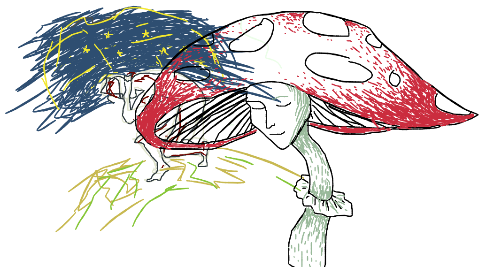

# atrament.js
#### Tiny JS library for beautiful drawing and handwriting on the HTML Canvas
---



Atrament is a lightweight library that enables the user to draw smooth, natural drawings and handwriting on the HTML canvas. The algorithm was originally developed about 2 weeks after I started learning JavaScript, as I wanted to build a collaborative drawing space on the web, which ended up being [1WALL](http://fiala.uk/1wall). I wanted the drawing to feel natural and comfortable, and the result to be smooth and pleasing. Years later, I've taken the algorithm, improved it, rewrote it in ES6 and made it into a neat little library.

[Here's a basic demo.](http://fiala.uk/atrament.js/demo/)

Enjoy!

## Usage

+ Include the script located at [https://github.com/jakubfiala/atrament.js/raw/master/dist/atrament.min.js](dist/atrament.min.js) in the `<head>` tag of your HTML.
+ create a `<canvas>` tag, e.g.:
```html
<canvas id="mySketcher" width="500px" height="500px">
```
+ in your JavaScript, call `atrament` passing in the selector string of your canvas:
```js
var sketcher = atrament('#mySketcher');
//or use a more object-oriented style
var sketcher = new Atrament('#mySketcher');
//you can also pass the canvas Node itself
var sketcher = new Atrament(document.querySelector('#mySketcher'));
```
+ you can also pass the width, height and default colour to the function:
```js
var sketcher = atrament('#mySketcher', 500, 500, 'orange');
```
+ that's it, happy drawing!

## Options & config

+ clear the canvas:
```js
sketcher.clear();
```
+ change the line thickness:
```js
sketcher.weight = 20; //in pixels
```
+ change the colour:
```js
sketcher.colour = `#ff485e`; //just like CSS
```
+ toggle the Erase mode:
```js
sketcher.mode = `erase`;
sketcher.mode = `draw`;
```
+ toggle smoothing - having it on makes the drawings look much better, turning it off makes it feel a bit more responsive:
```js
sketcher.smoothing = false;
```
+ change the opacity:
```js
sketcher.opacity = 0.5; //number between 0-1
```
+ export as image:
```js
//we have to get the dataURL of the image
var dataURL = sketcher.toImage();
//then we can, for instance, open a new window with it
window.open(dataURL);
```

## Development
To obtain the dependencies, `cd` into the atrament directory and run `npm install`.
You should be able to then build atrament by simply running `npm run build`.

I didn't bother writing tests because it's such a small package. Contributions are welcome!
